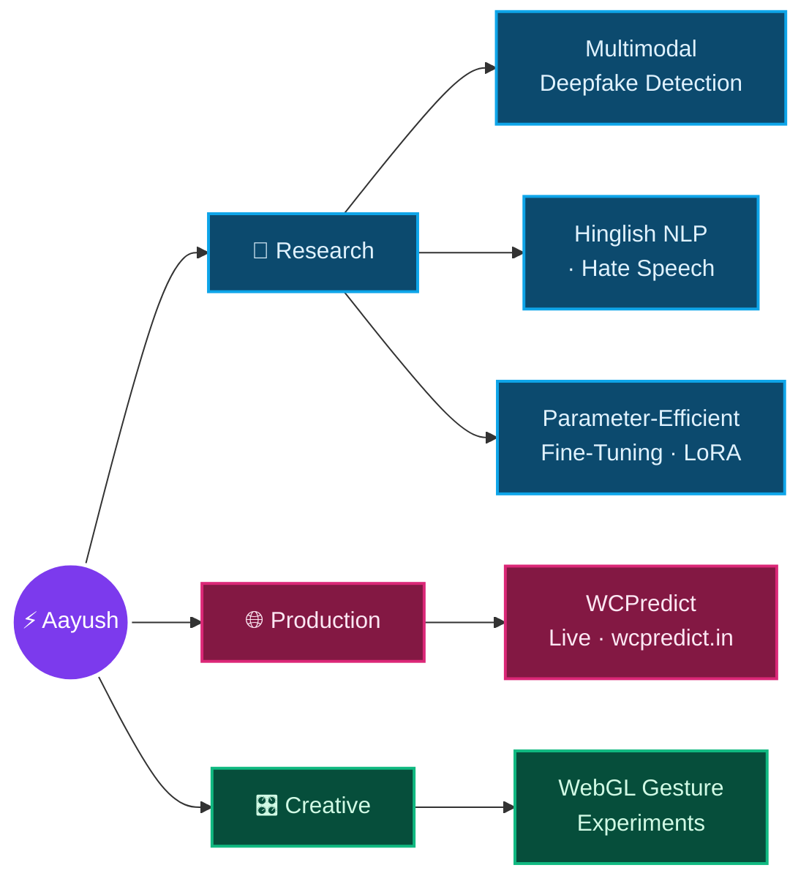

<!-- ╔══════════════════════════════════════════════════════════════╗ -->
<!-- ║                      AAYUSH SHARMA · README                    ║ -->
<!-- ╚══════════════════════════════════════════════════════════════╝ -->

 

 

> I'm a final-year CS undergrad at **Bennett University** who treats a research deadline and a `git push` to production as the same kind of fun. Most days I'm fine-tuning transformers for low-resource Indian languages or hunting deepfakes across audio and video — the rest of the time I'm bending webcam feeds into things you control with your bare hands. 📍 India

## ✦ &nbsp; About me

- 🔬 &nbsp;**Research intern @ Bennett University** — building multimodal deepfake detection (a dual-encoder LoRA setup: CLIP-ViT × WavLM) and a *first-of-its-kind* annotated **Hinglish meme dataset**, working alongside PhD scholars
- 📄 &nbsp;**Sole-authored** a paper on parameter-efficient Hinglish hate-speech detection — LoRA on **HingRoBERTa & MuRIL**, *matching full fine-tuning while training ~0.3% of the parameters*
- 🌐 &nbsp;Shipped **[WCPredict](https://wcpredict.in)** — a live FIFA World Cup 2026 forecasting engine (Elo → Dixon–Coles → Monte Carlo), resimulated **every hour** through GitHub Actions
- 🎛️ &nbsp;Build **gesture-controlled WebGL experiments** — corrupt reality through your webcam, cast shaders like spells, no mouse required
- ⚖️ &nbsp;Allergic to inflated metrics — I'd rather report the honest number than the flattering one

## ✦ &nbsp; The through-line

Everything I build sits somewhere on this map — rigorous research on one end, things you can click on the other.

## ✦ &nbsp; Arsenal

 

  

**Research / ML stack**

## ✦ &nbsp; Featured work

<table border="0" cellspacing="0" cellpadding="0">
<tr>
<td>

</td>
<td>

</td>
</tr>
<tr>
<td>

</td>
<td>

</td>
</tr>
<tr>
<td>

</td>
<td>

</td>
</tr>
</table>

## ✦ &nbsp; By the numbers

 

 

## ✦ &nbsp; Currently

- 🔭 &nbsp;Pushing the deepfake architecture toward **cross-modal LoRA rank ablations** & DoRA/VeRA comparisons
- 🧪 &nbsp;Scaling up the **Hinglish meme dataset** — OCR auto-filtering + overnight scrapes
- 📈 &nbsp;Iterating on **WCPredict** as the real tournament unfolds

 

### ⚡ Turning research into things you can click on.

